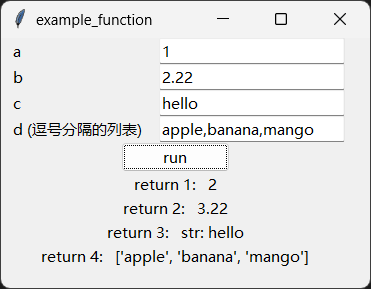
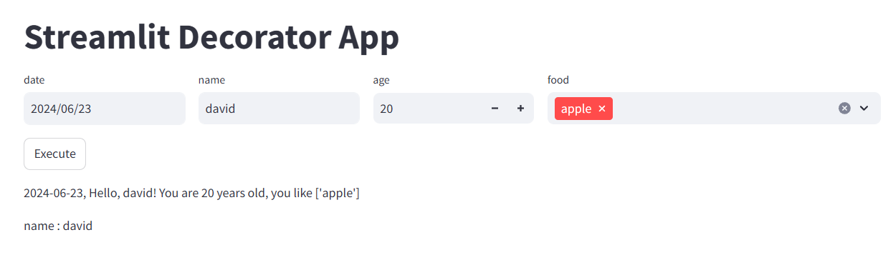
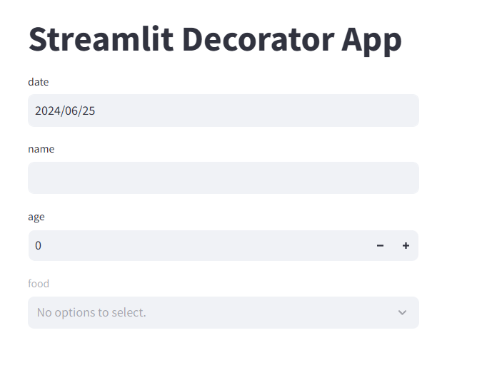

本模块是一个函数装饰器，根据函数的参数和返回值，自动生成相应的gui组件

## 目录
* [概述](README-zh.md##一、概述)
* [功能](README-zh.md##二、功能)
* [使用方法](README-zh.md##三、使用方法)
* [版本说明](README-zh.md##四、版本说明)

## 一、概述
本模块灵感来源于[magicgui](https://github.com/pyapp-kit/magicgui)，感谢作者

本模块设置两个分支，一个基于tkinter，一个基于streamlit

与magicgui的主要区别：

1、magicgui使用的工具是pyqt和pyside，本模块使用的是tkinter和streamlit
2、本模块只提供装饰器生成组件，不提供单独的gui组件
3、本模块可以返回输入组件的输入值，方便单独使用。

## 二、功能
基本功能：使用装饰器，根据函数的参数和返回值，自动生成对应的gui组件。

tkinter分支
> 	- 本分支主要基于tkinter，以及python标准库中的typing、ctypes。不需要安装pyside等第三方依赖。
> 	- 本分支本着简易使用的原则，只有一个装饰器函数，没有其他参数设置。
> 	- 本分支生成的输出组件，与返回值结果数量一致。
> 	- 进行了DPI的自动适配，界面不会显示模糊
> 	- 目前支持的参数类型：int、float、str、List[str]

streamlit分支
> 	- 本分支主要基于streamlit
> 	- 本分支可以设置输入组件水平放置，或者垂直放置。
> 	- 水平放置时，可以设置每个组件列宽比例。
> 	- 设置是否显示执行按钮，是否进行函数运算。
> 	- 返回每个组件的输入值，和函数运行结果值，用于后续单独使用。

## 三、使用方法
```python
pip install defgui
```

直接在函数上加上装饰器就可以使用

### 注意：定义函数时，参数需要带类型标识，否则报错

### 1、tkinter分支使用

- 本分支类型标识目前支持：int、float、str、List[str]
- 点击自动生成的run按钮，显示输出结果

```python
from defgui import defgui_tkinter
from typing import List

# 定义函数
@defgui_tkinter
def example_function(a: int, b: float,c: str,d: List[str])-> tuple:
	"""Example function that returns a tuple of four values."""
	return a + 1, b + 1,"str：%s"%(c),d

# 运行函数
example_function()
```
运行结果



### 2、streamlit分支使用

- 本分支类型标识目前支持：int、float、str、bool、list、datetime.date
- list参数，没有赋值时，生成组件因为没有可选项，会显示灰色不可用。建议list参数赋值运行。
- datetime.date参数，没有赋值时，生成的日期组件，默认使用当天日期
- 定义函数时，参数可以是位置参数，也可以是关键字参数，但必须有类型标识，否则报错
- 本分支装饰器，有3个默认参数：horizontal=True, col_size=None, execute=True
- **horizontal=True：**输入组件默认以水平排列
- **col_size=None：**列尺寸默认不设置，按输入组件数量，平均划分列宽
- **execute=True：**默认显示执行按钮，并进行函数运算。False则不显示。
- 被装饰函数执行时，默认返回输入组件值和结果值。输入组件值类型是列表，列表项顺序与函数的参数顺序一致。
- 被装饰函数可以赋值执行，也可以不赋值运行

（1）参数赋值运行、组件水平排列、显示执行按钮
```python
from defgui import defgui_streamlit
import streamlit as st
import datetime

st.set_page_config(layout="wide")
st.title("Streamlit Decorator App")

@defgui_streamlit(horizontal=True, col_size=[1, 1, 1, 2, 2], execute=True)
def greet(date: datetime.date, name: str, age: int=20 , food: list=[]) -> str:
	return f"{date}, Hello, {name}! You are {age} years old, you like {food}"

input_values, results = greet(name="david",food=["apple", "banana"])

st.write(input_values[1])

```


（2）参数不赋值，组件竖向排列，不显示执行按钮
```python
from defgui import defgui_streamlit
import streamlit as st
import datetime
st.set_page_config(layout="wide")
st.title("Streamlit Decorator App")

@defgui_streamlit(horizontal=False, col_size=None, execute=False)
def greet(date: datetime.date, name: str, age: int , food: list) -> str:
	return f"{date}, Hello, {name}! You are {age} years old, you like {food}"

cols = st.columns(3)
with cols[0]:
	greet()

```


## 四、版本说明

v 0.2
增加基于streamlit的装饰器

v 0.1
基于tkinter的装饰器
