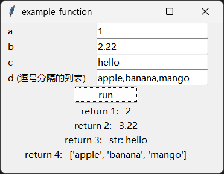

[中文](README-zh.md)

This module is a function decorator that automatically generates corresponding GUI components based on the function's parameters and return values.
## Table of Contents
* [Overview](README.md##overview)
* [Features](README.md##features)
* [Usage](README.md##usage)
* [Version Notes](README.md##version-notes)

## Overview
This module is inspired by [magicgui](https://github.com/pyapp-kit/magicgui), thank you to the author.
This module has two branches: one based on tkinter and one based on streamlit.
Main differences from magicgui:
1. Magicgui uses pyqt and pyside as tools, while this module uses tkinter and streamlit.
2. This module only provides a decorator to generate components, not separate GUI components.
3. This module can return the input values of input components, which is convenient for separate use.

## Features
Basic function: Use a decorator to automatically generate corresponding GUI components based on the function's parameters and return values.

**tkinter branch**
* Based mainly on tkinter and the typing and ctypes libraries from the Python standard library. No third-party dependencies like pyside are required.
* Based on the principle of easy use, this branch has only one decorator function and no other parameter settings.
* The output components generated by this branch are consistent with the number of return values.
* DPI adaptation is automatically performed, and the interface will not be blurred.
* Currently supported parameter types: int, float, str, List[str]

**streamlit branch**
* Based mainly on streamlit.
* This branch allows you to set whether input components are placed horizontally or vertically.
* When placed horizontally, you can set the column width ratio for each component.
* You can set whether to display the execute button and whether to perform function calculations.
* Returns the input values of each component and the function execution result values for subsequent separate use.

## Usage
```python
pip install defgui
```
You can use it directly by adding a decorator to the function.
### Note: When defining the function, the parameters need to have type annotations, otherwise an error will be reported.

### 1. Using the tkinter branch
- Currently supported type annotations for this branch: int, float, str, List[str]
- Click the automatically generated run button to display the output results.
```python
from defgui import defgui_tkinter
from typing import List
# Define the function
@defgui_tkinter
def example_function(a: int, b: float, c: str, d: List[str]) -> tuple:
    """Example function that returns a tuple of four values."""
    return a + 1, b + 1, "str：%s" % (c), d
# Run the function
example_function()
```
Running results



### 2. Using the streamlit branch
- Currently supported type annotations for this branch: int, float, str, bool, list, datetime.date
- For list parameters, if not assigned a value, the generated component will not have any options and will appear grey and unavailable. It is recommended to assign a value to the list parameter before running it.
- For datetime.date parameters, if not assigned a value, the generated date component will default to the current date.
- When defining the function, the parameters can be positional or keyword parameters, but they must have type annotations, otherwise an error will be reported.
- This branch of the decorator has 3 default parameters: horizontal=True, col_size=None, execute=True
- **horizontal=True:** Input components are placed horizontally by default.
- **col_size=None:** Column size is not set by default, and the column width is divided evenly according to the number of input components.
- **execute=True:** The execute button is displayed by default, and function calculations are performed. False will not display it.
- When the decorated function is executed, it defaults to returning the input values of the input components and the result values. The input values are of list type, and the order of list items is consistent with the order of function parameters.
- The decorated function can be executed with or without values assigned.

#### (1) Executing with parameter assignment, components placed horizontally, and the execute button displayed
```python
from defgui import defgui_streamlit
import streamlit as st
import datetime
st.set_page_config(layout="wide")
st.title("Streamlit Decorator App")
@defgui_streamlit(horizontal=True, col_size=[1, 1, 1, 2, 2], execute=True)
def greet(date: datetime.date, name: str, age: int = 20, food: list = []) -> str:
    return f"{date}, Hello, {name}! You are {age} years old, you like {food}"
input_values, results = greet(name="david", food=["apple", "banana"])
st.write(input_values[1])
```


#### (2) Executing without parameter assignment, components placed vertically, and the execute button not displayed
```python
from defgui import defgui_streamlit
import streamlit as st
import datetime
st.set_page_config(layout="wide")
st.title("Streamlit Decorator App")
@defgui_streamlit(horizontal=False, col_size=None, execute=False)
def greet(date: datetime.date, name: str, age: int, food: list) -> str:
    return f"{date}, Hello, {name}! You are {age} years old, you like {food}"
cols = st.columns(3)
with cols[0]:
    greet()
```


## Version Notes
v 0.2
Added a decorator based on streamlit

v 0.1
Decorator based on tkinter
